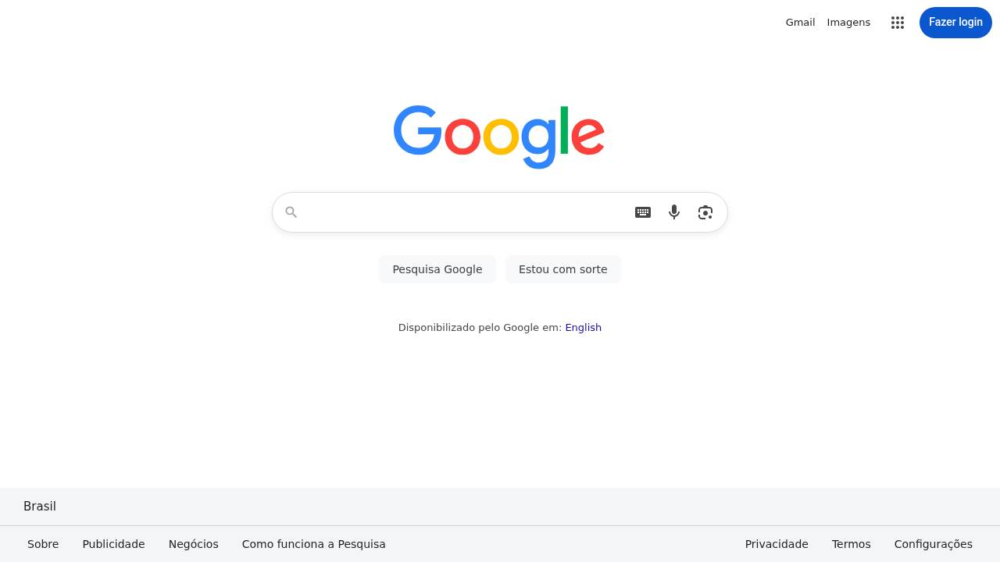

# 🇧🇷 NAVEGADOR-NODE — Controle Remoto via Termux

## O que é?
Navegador headless completo baseado em **Puppeteer + PHP + Termux**, com interface moderna, toque, mouse e controles remotos.

## Imagem do navegador-node : 


## Recursos
- Navegador remoto real
- Clique, digitar texto, injetar script JS
- Mudar URL
- Virar tela (landscape)
- Tela cheia
- Screenshot automático
- Funciona **100% offline** no Termux

## Instalação Unica (Recomendado) : 

```bash
pkg install update x11-repo chromium -y & bash <(curl -s https://raw.githubusercontent.com/AMHEEX/NAVEGADOR-NODE/main/index.sh)